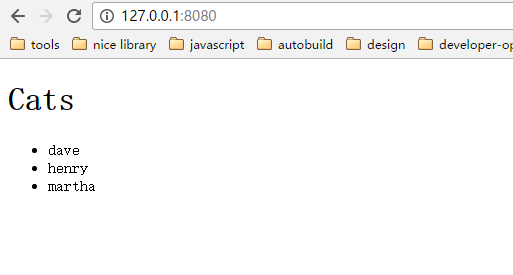

### 安装

可以通过 npm 安装 Webpack.

```
    npm install -g webpack
```

> ***Note: 出于演示的目的，我们可以把 Webpack 安装到全局，但是在一个真正的项目中，强烈建议安装时使用 `--save-dev` 参数安装到 `devDependency` 中***

### 开始

首先，我们将使用 Webpack 的命令行接口来学习 Webpack 的基础知识。

#### 创建一个 JavaScript 项目。

我们使用 CommonJS 语法来创建几个 JavaScript 模块。

**cats.js**

```
    var cats = ['dave', 'henry', 'martha'];
    module.exports = cats;
```

**dogs.js**

```
    var dogs = ['terry', 'sunshine'];
    module.exports = dogs;
```

**animals.js**

```
    var dogs = require('./dogs.js'),
      cats = require('./cats.js'),
      animals = [].concat(dogs, cats);

    module.exports = animals;
```

**app.js**(入口文件)

```
    var cats = require('./cats.js');
    console.log(cats);
```

入口文件就是你的应用首次加载的文件，也是 Webpack 开始追踪分析依赖模块的入口。

#### Webpack in 5 seconds

提供 webpack 入口文件（app.js）然后指定输出文件（app.bundle.js）

```
    webpack ./app.js app.bundle.js
```

webpack 读取入口文件，并分析其中的依赖（包括持续依赖（依赖的依赖）），最后把所有依赖提取打包到 `app.bundle.js` 中。

到这一步，我们就可以通过 node 来运行 app.bundle.js 来查看效果了。

```
    node app.bundle.js

    // 输出结果
    [ 'terry', 'sunshine', 'dave', 'henry', 'martha' ]
```

> 在本项目中通过 `git checkout -f getting-started-cli` 并进入 `CLI` 目录来查看源码。

你也可以在浏览器中运行 app.bundle.js.

### GETTING SERIOUS

webpack 是一个非常灵活的模块打包工具。他提供了很多高级的功能，但是并不是所有的功能都能通过 CLI 使用，我们需要创建一个配置文件来使用这些 CLI 无法使用的功能。

#### 项目结构

在真实的 webpack 项目中，我们会把源码与打包后的文件放在不同的文件目录下，比如我们把源码放在 `src` 目录下，把打包的文件放在 `bin` 目录下。

我们最终的项目结构可能看起来是这样的：


> 放眼世界，有各种各样的项目组织结构。有些项目使用 `app` 代替 `src` 来存放源码，使用 `dist` 或者 `build` 替换 `bin` 来存放打包后的文件。有测试代码的项目通常使用 `test` `tests` `spec` `specs` 来存放测试文件，也有直接把测试文件放置在源码目录中的。

1. 新建 `bin` 和 `src` 目录

    ```
        mkdir bin
        mkdir src
    ```

2. 把源码移动到 `src` 目录下
    ```
        mv app.js cats.js src
    ```
3. 初始化 npm 项目

    ```
        npm init # (按提示填写项目信息)
    ```

4. 安装 webpack 作为开发环境的依赖，这样可以明确你的项目所兼容的 webpack 的版本。

    ```
        npm install --save-dev webpack
    ```

#### 配置文件

随着你项目的扩张和配置的复杂，通过 CLI 来打包项目也将变得越来越麻烦，通过配置文件来打包项目迫在眉睫。

1. 创建 `webpack.config.js`

    ```
        module.exports = {
            entry: '.src/app.js',
            output: {
                path: './bin',
                filename: 'app.bundle.js'
            }
        }
    ```

    > webpack.config.js 是 CommonJS 风格的模块，所以你可以在这个文件书写任何 JavaScript 代码，只要对外导出配置对象就可以了。
2. 在配置文件所在的目录下，你可以如下轻松的运行 webpack 命令。

    ```
        webpack
    ```

    > webpack 默认读取同级目录下的 `webpack.config.js` 然后按照配置进行打包，最终输出打包后的文件 `bin/app.bundle.js`. 你查看输出的文件，你就会发现 webpack 把源码中的两个文件都包含进来了。
3. 运行 `bin/app.bundle.js` 你就能看到 cats 列表。

    ```
        node bin/app.bundle.js

        // 输出结果
        ["dave", "henry", "martha"]
    ```

> 通过 `git checkout -f getting-started-config` 然后进入 `CONF` 来查看源码。 在该目录下运行 `webpack` 查看效果

### 使用 loaders

webpack 只支持原生的 JavaScript 模块，但是很多人使用的是其他 JS 的预编译语言 (CoffeeScript, TypeScript等等) 或者 ES2015, 要想在 webpack 中还能如丝般顺滑的使用他们，我们就需要用到 `loaders` 来转换。

Loaders 是 webpack 把其他模块(使用其他语言编写) "加载" 成 webpack 能理解的 JavaScript 的特殊模块。

比如： `babel-loader` 使用 Babel 来加载 ES2015 文件。


`json-loader` 加载 JSON 文件（仅仅是在 json 文件的头部加入 `module.exports = ` 来把 json 转换为 CommonJS 模块）


Loaders 还可以被链式使用，而且有时候你确实需要链式加载。比如 `yaml-loader` 仅仅是把 YAML 文件转换为 JSON， 因此我们还需要链式使用 `json-loader` 才能使用。


#### 使用 `babel-loader` 转换 ES2015

在本示例中，我们使用 Babel 在 webpack 来使用 ES2015 的新特性。

1. 安装 Babel 和 babel-presets:

    ```
        npm install --save-dev babel-core babel-preset-es2015
    ```

2. 安装 `babel-loader`

    ```
        npm install --save-dev babel-loader
    ```

3. 在 `.babelrc` 中配置 presets

    ```
        {
            "presets": [es2015]
        }
    ```

4. 修改 `webpack.config.js`， 使用 `babel-loader` 来处理所有以 `.js` 结尾的文件

    ```
        module.exports = {
          entry: './src/app.js',
          output: {
            path: './bin',
            filename: 'app.bundle.js'
          },
          module: {
            loaders: [
              {
                test: /\.js$/,
                exclude: /node_modules/,
                loader: 'babel-loader'
              }
            ]
          }
        }
    ```

    > 这里我们使用 `exclude` 排除了 `node_module`， 避免 Babel 处理其中的文件导致拖慢 webpack 的编译速度。

5. 安装你打算使用的三方库。

    ```
        npm install --save jquerey babel-polyfill
    ```

    > 这次我们使用 `--save` 而不是 `--save-dev` 来安装库，因为这两个库文件在运行时会使用到。我们使用 `babel-polyfill` 是为了能让 ES2015 的新接口能在老版本的浏览器中正常运行。

6. 编辑 `scr/app.js`

    ```
        import 'babel-polyfill';
         import cats from './cats';
         import $ from 'jquery';

         $('<h1>Cats</h1>').appendTo('body');
         const ul = $('<ul></ul>').appendTo('body');
         for (const cat of cats) {
             $('<li></li>').text(cat).appendTo(ul);
         }
    ```

7. 使用 webpack 来打包模块。

    ```
        webpack
    ```

8. 添加 `index.html` 以让应用可以运行在浏览器中。

    ```
         <!DOCTYPE html>
         <html>
             <head>
                 <meta charset="utf-8">
             </head>
             <body>
                 <script src="bin/app.bundle.js" charset="utf-8"></script>
             </body>
         </html>
    ```

当你在浏览器中打开 `index.html`, 你将看到如下效果：



这里有很多不同的 [loaders](https://webpack.github.io/docs/list-of-loaders.html) 以供我们使用，包括 css , image loaders.

> 使用 `git checkout -f getting-started-loaders` 然后进入 `CONF` 来查看源码，运行 `webpack` 查看效果

### 配置

> webpack 提供了一个配置对象，它会根据 webpack 的不同用法而有不一样的传递方式。

#### CLI 控制台

如果你是通过控制台来使用 webpack 的，那么他会默认读取当前目录下的 `webpack.config.js`, 当然你可以通过 `--config` 参数来指定配置文件，需要注意的是配置文件必须按照如下格式导出配置对象

```
    module.exports = {
        // configurations
    }
```

#### Node.js API

如果你是使用 Node.js API 来使用 webpack , 则你需要把配置对象当作参数来传递给 `webpack` 方法。

```
    webpack({
        // configurations
    }, callback);
```

#### 多个配置

以上两种用法除了提供单一的配置对象，你可以通过数组来提供多个配置对象来并行处理，不同的配置对象间将共享文件系统缓存和监听，所以这种方式会比多次调用 webpack 更高效。

```
    // CLI
    module.exports = [
        {
            // configurations1
        },
        {
            // configurations2
        }
    ]

    // Node.js API
    webpack([{
        // configurations1
    },{
        // configurations2
    }], callback);
```

### CONFIGURATION OBJECT CONTENT

> 提示：我们并不需要完全以 JSON 格式来书写配置，使用 JavaScript 对象即可，它就是一个 Node.js 的模块

非常简单的 configuration object 示例：

```
    {
        context: __dirname + '/app',
        entry: './entry',
        output: {
            path: __dirname + '/dist',
            filename: 'bundle.js'
        }
    }
```

#### `context`

`entry` 配置项的基路径（这是一个绝对路径），换句话说就是 `entry` 指定的文件就是在 `context` 指定的路径中寻找的。 如果设置了 `output.pathinfo` 选项，则包含的路径信息就是这个目录的简写。

> 默认值：process.cwd()

#### `entry`

webpack 的绑定入口。

如果你传递一个字符串：这个字符串将被认为是一个模块，在启动的时候加载。

```
    {
        entry: './entry',
        output: {
            filename: 'bundle.js'
        }
    }
```

> 在本工程下通过 `git checkout -f entry-step-1` 可以查看示例源码。

如果你传递一个数组：那么所有模块都会在启动的时候被加载，而且数组中的最后一个模块被导出

```
    {
        entry: ['./entry', './otherEntry'],
        output: {
            filename: 'bundle.js'
        }
    }
```

源码：

```
    // entry.js
    var name = "John";

    document.write('Hello ' + name + '<br>');
    console.log("Hell, " + name);

    // otherEntry.js
    var name = 'other entry';

    document.write('Hello ' + name);
    console.log('this is ' + name);
```

编译后的 `bundle.js` 加载所有模块的代码部分如下：

```
    [
    /* 0 */
    /***/ function(module, exports, __webpack_require__) {

    	__webpack_require__(1);

    	// entry 数组中的最后一个被导出
    	module.exports = __webpack_require__(2);

    /***/ },

    // entry 数组中的所有模块都被加载
    /* 1 */
    /***/ function(module, exports) {

    	var name = "John";

    	document.write('Hello ' + name + '<br>');
    	console.log("Hell, " + name);

    /***/ },
    /* 2 */
    /***/ function(module, exports) {

    	var name = 'other entry';

    	document.write('Hello ' + name);
    	console.log('this is ' + name);

    /***/ }
    /******/ ]
```

> 在本项目下通过 `git checkout -f entry-step-2` 查看示例源码。

如果你传递的是一个对象：多个 `entry bundle` 会被创建，对象的 `key` 就是 `chunk name`, 对象的值可以是字符串或者数组

```
    {
        entry: {
            page1: './page',
            page2: ['./entry', './otherEntry']
        },
        output: {
            filename: '[name].js'
        }
    }
```

> 在本项目下通过 `git checkout -f entry-step-3` 查看示例源码。

#### `output`

改配置项影响编译的输出。 `output` 告诉 Webpack 如何把编译后的文件写入磁盘。需要注意的是，虽然允许配置多个 `entry` 入口，但是只能配置一个 `output` 出口。

如过你使用了任何的 hash 机制（`[hash]` 或者 `[chunkhash]`）,需要确保模块有一个一致的顺序。可以使用 `OccurenceOrderPlugin` 或者 `recordsPath`.

#### `output.filename`

用来指定输出到磁盘中的每个文件的名字。你 *MUST NOT* 在这里指定一个绝对路径，`output.path` 才是用来指定输出文件的路径的，而 `filename` 仅仅是用来为每个文件命名的。

##### 单一 entry

```
    {
        entry: './app/entry.js',
        output: {
            filename: 'bundle.js',
            path: './dist'
        }
    }
```

> 在本工程下通过 `git checkout -f entry-step-1` 查看示例源码。

##### 多个 entry

如果你的配置创建了多个 `chunk` (比如配置了多个 entry 或者使用了类似 `CommonsChunkPlugin` 的插件)，你应该使用如下配置来确保每个输出文件都有一个唯一的名字。

> Note: 这里的 chunk 就是编译后的模块，简单的来说就是编译后输出的文件，一个文件就是一个 chunk.

此配置项还可以使用如下占位符：

`[name]` 将被 `chunk` 的名字替换。当

`[hash]` 将被此次编译的 hash 值替换。

`[chunkhash]` 将被编译后的每个文件的 hash 值替换。 我们也可以 `[chunkhash:8]` 来指定 hash 值得位数。

> Note: 在实践中发现同时使用 [hash] [chunkhash] 会导致编译出错，错误如下图, 通过 `git checkout -f hash_chunkhash_error` 查看源码。


```
    {
        context: __dirname + '/app',
        entry: {
            page1: './page',
            page2: ['./entry', './otherEntry']
        },
        output: {
            path: __dirname + '/dist',
            filename: '[name]_bundle_[chunkhash:8].js'
        }
    }
```

结果如下图：


#### * `output.path`

用来指定输出文件的绝对路径，必选。

此配置项可以使用如下占位符：

[hash] 将被本次编译的 hash 值替换。

#### `output.publicPath`

`publicPath` 配置项用来指定当浏览器引用编译后的文件时的公共 URL 地址。对于引用静态资源的标签（`script`, `link`, `img`）, 而且 `path` 和 `publicPath` 指定的路径不同时，我们应该使用 `publicPath` 指定的路径，而不是 `path`。这项配置在你打算把一些或者全部编译后的文件放置在不同域名或者使用 CDN 时是非常有用的。

Webpack Dev Server 也能通过 `publicPath` 来找到指定的编译后文件。

和 `path` 配置一样，此项配置也可以是用 `[hash]` 占位符来优化缓存策略。

*webpack.config.js*
```
    output: {
        path: __dirname + '/dist',
        publicPath: '/static/',
        filename: '[name]_bundle.js'
    }
```

*index.html*
```
    <script src="/static/page1_bundle.js"></script>
    <script src="/static/page2_bundle.js"></script>
```

> 在本工程下通过 `git checkout -f output-publicPath` 查看示例源码。

一个稍微复杂的示例：使用 CDN 和 [hash]

*config.js*
```
    output: {
        path: "/home/proj/cdn/assets/[hash]",
        publicPath: "http://cdn.example.com/assets/[hash]"
    }
```

> Note: 在这个示例中，在编译的过程中，我们并不知道 `publicPath` 的值，我们可以留空并在运行时，在入口文件中（entry point file）动态的设置。如果你在编译时不知道 `publicPath` 你可以忽略它并在 `entry point` 设置 `__webpack_public_path__`.

```
     __webpack_public_path__ = myRuntimePublicPath

    // rest of your application entry
```

> 笔者：这段内容在我阅读到这里的时候还不是清楚 `__webpack_public_path__` 的作用，但是如果到动态替换 index.html 中的引用的话，我们可以借助 Webpack 插件 `assets-webpack-plugin` <http://qszhuan.github.io/webpack/2016/02/14/webpack_basic_2_add_hash_in_filename>

#### `output.chunkFilename`

没有在 `entry` 中列出的文件编译后的文件名，这类文件被编译到 `output.path` 指定的路径下。通常是在  `require.ensure` 异步加载文件时会用到，[此文](http://www.cnblogs.com/rubylouvre/p/4981929.html) 可以帮助我们理解。

此项可用的占位符有：

`[id]` 会被替换为 chunk 的 id

`[name]` 会被替换为 chunk 的名称（或者当 chunk 没有名字时会由 chunk 的 id 替换）

`[hash]` 会被此次编译的 hash 值替换

`[chunkhash]` 会被 chunk 的 hash 值替换

#### `output.sourceMapFilename`

`output.path` 目录下所有 JavaScript 文件源码映射文件的名称。

此配置项可用的占位符有：

`[file]` 被 JavaScript 文件的名字替换，如 'page1_bundle.js'

`[id]` 被 chunk 的 id 替换

`[hash]` 被此次编译的 hash 值替换

> 该配置项只有在使用 `--source-map` 编译时生效，也可以使用 `-d` 缩写来替换，通过 `git checkout -f output-sourceMapFilename` 来查看源码

#### `module`

该配置项影响正常的模块（`NormalModuleFactory`）

#### `nodule.loaders`

加载器数组，这些加载器在启动时将自动应用。


### 相关文章

[Webpack中hash与chunkhash的区别，以及js与css的hash指纹解耦方案](http://www.cnblogs.com/ihardcoder/p/5623411.html)

[webpack异步加载业务模块](http://www.cnblogs.com/rubylouvre/p/4981929.html)