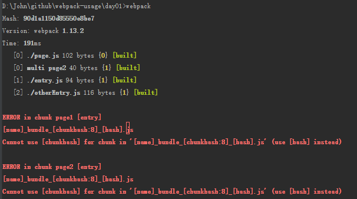

### 配置

> webpack 提供了一个配置对象，它会根据 webpack 的不同用法而有不一样的传递方式。

#### CLI 控制台

如果你是通过控制台来使用 webpack 的，那么他会默认读取当前目录下的 `webpack.config.js`, 当然你可以通过 `--config` 参数来指定配置文件，需要注意的是配置文件必须按照如下格式导出配置对象

```
    module.exports = {
        // configurations
    }
```

#### Node.js API

如果你是使用 Node.js API 来使用 webpack , 则你需要把配置对象当作参数来传递给 `webpack` 方法。

```
    webpack({
        // configurations
    }, callback);
```

#### 多个配置

以上两种用法除了提供单一的配置对象，你可以通过数组来提供多个配置对象来并行处理，不同的配置对象间将共享文件系统缓存和监听，所以这种方式会比多次调用 webpack 更高效。

```
    // CLI
    module.exports = [
        {
            // configurations1
        },
        {
            // configurations2
        }
    ]

    // Node.js API
    webpack([{
        // configurations1
    },{
        // configurations2
    }], callback);
```

### CONFIGURATION OBJECT CONTENT

> 提示：我们并不需要完全以 JSON 格式来书写配置，使用 JavaScript 对象即可，它就是一个 Node.js 的模块

非常简单的 configuration object 示例：

```
    {
        context: __dirname + '/app',
        entry: './entry',
        output: {
            path: __dirname + '/dist',
            filename: 'bundle.js'
        }
    }
```

#### `context`

`entry` 配置项的基路径（这是一个绝对路径），换句话说就是 `entry` 指定的文件就是在 `context` 指定的路径中寻找的。 如果设置了 `output.pathinfo` 选项，则包含的路径信息就是这个目录的简写。

> 默认值：process.cwd()

#### `entry`

webpack 的绑定入口。

如果你传递一个字符串：这个字符串将被认为是一个模块，在启动的时候加载。

```
    {
        entry: './entry',
        output: {
            filename: 'bundle.js'
        }
    }
```

> 在本工程下通过 `git checkout -f entry-step-1` 可以查看示例源码。

如果你传递一个数组：那么所有模块都会在启动的时候被加载，而且数组中的最后一个模块被导出

```
    {
        entry: ['./entry', './otherEntry'],
        output: {
            filename: 'bundle.js'
        }
    }
```

源码：

```
    // entry.js
    var name = "John";

    document.write('Hello ' + name + '<br>');
    console.log("Hell, " + name);

    // otherEntry.js
    var name = 'other entry';

    document.write('Hello ' + name);
    console.log('this is ' + name);
```

编译后的 `bundle.js` 加载所有模块的代码部分如下：

```
    [
    /* 0 */
    /***/ function(module, exports, __webpack_require__) {

    	__webpack_require__(1);

    	// entry 数组中的最后一个被导出
    	module.exports = __webpack_require__(2);

    /***/ },

    // entry 数组中的所有模块都被加载
    /* 1 */
    /***/ function(module, exports) {

    	var name = "John";

    	document.write('Hello ' + name + '<br>');
    	console.log("Hell, " + name);

    /***/ },
    /* 2 */
    /***/ function(module, exports) {

    	var name = 'other entry';

    	document.write('Hello ' + name);
    	console.log('this is ' + name);

    /***/ }
    /******/ ]
```

> 在本项目下通过 `git checkout -f entry-step-2` 查看示例源码。

如果你传递的是一个对象：多个 `entry bundle` 会被创建，对象的 `key` 就是 `chunk name`, 对象的值可以是字符串或者数组

```
    {
        entry: {
            page1: './page',
            page2: ['./entry', './otherEntry']
        },
        output: {
            filename: '[name].js'
        }
    }
```

> 在本项目下通过 `git checkout -f entry-step-3` 查看示例源码。

#### `output`

改配置项影响编译的输出。 `output` 告诉 Webpack 如何把编译后的文件写入磁盘。需要注意的是，虽然允许配置多个 `entry` 入口，但是只能配置一个 `output` 出口。

如过你使用了任何的 hash 机制（`[hash]` 或者 `[chunkhash]`）,需要确保模块有一个一致的顺序。可以使用 `OccurenceOrderPlugin` 或者 `recordsPath`.

#### `output.filename`

用来指定输出到磁盘中的每个文件的名字。你 *MUST NOT* 在这里指定一个绝对路径，`output.path` 才是用来指定输出文件的路径的，而 `filename` 仅仅是用来为每个文件命名的。

##### 单一 entry

```
    {
        entry: './app/entry.js',
        output: {
            filename: 'bundle.js',
            path: './dist'
        }
    }
```

> 在本工程下通过 `git checkout -f entry-step-1` 查看示例源码。

##### 多个 entry

如果你的配置创建了多个 `chunk` (比如配置了多个 entry 或者使用了类似 `CommonsChunkPlugin` 的插件)，你应该使用如下配置来确保每个输出文件都有一个唯一的名字。

> Note: 这里的 chunk 就是编译后的模块，简单的来说就是编译后输出的文件，一个文件就是一个 chunk.

此配置项还可以使用如下占位符：

`[name]` 将被 `chunk` 的名字替换。当

`[hash]` 将被此次编译的 hash 值替换。

`[chunkhash]` 将被编译后的每个文件的 hash 值替换。 我们也可以 `[chunkhash:8]` 来指定 hash 值得位数。

> Note: 在实践中发现同时使用 [hash] [chunkhash] 会导致编译出错，错误如下图, 通过 `git checkout -f hash_chunkhash_error` 查看源码。



```
    {
        context: __dirname + '/app',
        entry: {
            page1: './page',
            page2: ['./entry', './otherEntry']
        },
        output: {
            path: __dirname + '/dist',
            filename: '[name]_bundle_[chunkhash:8].js'
        }
    }
```

结果如下图：


#### * `output.path`

用来指定输出文件的绝对路径，必选。

此配置项可以使用如下占位符：

[hash] 将被本次编译的 hash 值替换。

#### `output.publicPath`

`publicPath` 配置项用来指定当浏览器引用编译后的文件时的公共 URL 地址。对于引用静态资源的标签（`script`, `link`, `img`）, 而且 `path` 和 `publicPath` 指定的路径不同时，我们应该使用 `publicPath` 指定的路径，而不是 `path`。这项配置在你打算把一些或者全部编译后的文件放置在不同域名或者使用 CDN 时是非常有用的。

Webpack Dev Server 也能通过 `publicPath` 来找到指定的编译后文件。

和 `path` 配置一样，此项配置也可以是用 `[hash]` 占位符来优化缓存策略。

*webpack.config.js*
```
    output: {
        path: __dirname + '/dist',
        publicPath: '/static/',
        filename: '[name]_bundle.js'
    }
```

*index.html*
```
    <script src="/static/page1_bundle.js"></script>
    <script src="/static/page2_bundle.js"></script>
```

> 在本工程下通过 `git checkout -f output-publicPath` 查看示例源码。

一个稍微复杂的示例：使用 CDN 和 [hash]

*config.js*
```
    output: {
        path: "/home/proj/cdn/assets/[hash]",
        publicPath: "http://cdn.example.com/assets/[hash]"
    }
```

> Note: 在这个示例中，在编译的过程中，我们并不知道 `publicPath` 的值，我们可以留空并在运行时，在入口文件中（entry point file）动态的设置。如果你在编译时不知道 `publicPath` 你可以忽略它并在 `entry point` 设置 `__webpack_public_path__`.

```
     __webpack_public_path__ = myRuntimePublicPath

    // rest of your application entry
```

> 笔者：这段内容在我阅读到这里的时候还不是清楚 `__webpack_public_path__` 的作用，但是如果到动态替换 index.html 中的引用的话，我们可以借助 Webpack 插件 `assets-webpack-plugin` <http://qszhuan.github.io/webpack/2016/02/14/webpack_basic_2_add_hash_in_filename>

#### `output.chunkFilename`

没有在 `entry` 中列出的文件编译后的文件名，这类文件被编译到 `output.path` 指定的路径下。通常是在  `require.ensure` 异步加载文件时会用到，[此文](http://www.cnblogs.com/rubylouvre/p/4981929.html) 可以帮助我们理解。

此项可用的占位符有：

`[id]` 会被替换为 chunk 的 id

`[name]` 会被替换为 chunk 的名称（或者当 chunk 没有名字时会由 chunk 的 id 替换）

`[hash]` 会被此次编译的 hash 值替换

`[chunkhash]` 会被 chunk 的 hash 值替换

#### `output.sourceMapFilename`

`output.path` 目录下所有 JavaScript 文件源码映射文件的名称。

此配置项可用的占位符有：

`[file]` 被 JavaScript 文件的名字替换，如 'page1_bundle.js'

`[id]` 被 chunk 的 id 替换

`[hash]` 被此次编译的 hash 值替换

> 该配置项只有在使用 `--source-map` 编译时生效，也可以使用 `-d` 缩写来替换，通过 `git checkout -f output-sourceMapFilename` 来查看源码

### 相关文章

[Webpack中hash与chunkhash的区别，以及js与css的hash指纹解耦方案](http://www.cnblogs.com/ihardcoder/p/5623411.html)

[webpack异步加载业务模块](http://www.cnblogs.com/rubylouvre/p/4981929.html)